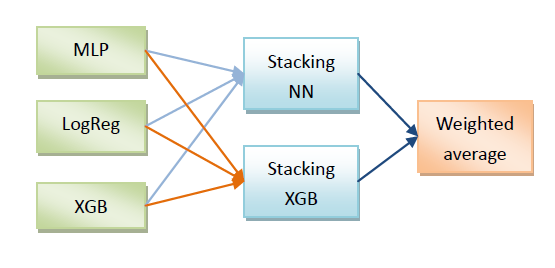

# 易观性别年龄预测算法大赛--第8名解决方案

易观性别年龄预测比赛，利用手机采集的设备数据、应用数据等，进行模型训练，并用训练好的模型预测手机用户的性别和年龄。  
具体的赛题介绍可以看[这里](<https://www.tinymind.cn/competitions/43>)。

## 解题思路
由于没有太多的时间投入比赛，所以自己的解题思路是：快速地将参加此类比赛的“套路”走一遍，至于需要花费大量时间精力的调优工作，暂且放在一边。  
参加此类算法比赛的一般“套路”如下：  
分析数据->构造特征->测试模型->调参->模型融合  
其中每一步都有大量工作要做，由于时间不够，我只做了三个主要工作：特征构造、模型测试和模型融合。  
借鉴比较流行的三层学习架构，整体的解题方法如下图所示：  
    
构造完特征之后，用这些特征分别训练MLP，Logistic Regression和XGB三个模型，然后使用两种方法（NN和XGB）将它们分别Stacking起来，最后将两个堆叠的结果加权平均一下，最终的线上成绩是2.5722。
## 特征构造
由于笔记本算力有限，用python处理3点多G的“手机应用开关记录”比较费力，所以就用C++代码来构建与之相关的特征，另外，一些其它特征也是使用C++构造的。C++基本在5分钟内搞定，Python不知道要运行多久。  
构造的特征包括：  
1. Brand  
2. Model  
3. InstalledApps  
4. InstalledAppsNumber  
5. BagOfAppCategories_TFIDF  
6. AvgTimeOfAppsUsage  
7. TotalTimeOfAppsUsage  
8. AvgTimeOfAppCategoriesUsage  
9. KindsOfAppUsagePerDay  
10. KindsOfAppCatUsagePerDay  
11. NumOfProcessUsagePerDay  
12. TimeDistOfUserActivities  
13. MostActiveHour  
14. DayDistOfUserActivities  
15. MostActiveDay  
训练模型时，这些特征只用到了其中几个。
## 总结
快速地把“套路”走一遍，也许可以得到一个相对靠前的分数，但要进入前几名，还是需要投入相当多的时间和精力的。